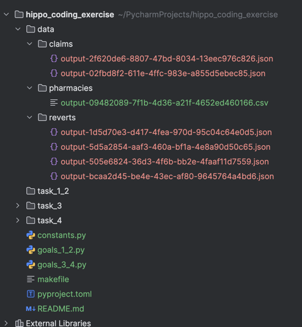

# Hippo Coding Exercise

## Introduction
This is a solution for the Hippo Coding Exercise tasks.

## Setup
1. **Clone the Repository:**
   - Clone this repository to your local machine using `git clone` or download the zip file.

2. **Install Dependencies:**
   - Ensure Python 3.12 and Poetry are installed on your system.
   - Run the following command to install all dependencies from the `pyproject.toml` file:
     ```bash
     poetry install
     ```

## Preparing the Data
1. **Data Folder Structure:**
   - Ensure your data folder structure is as follows:
     ```
     data/
     ├── claims/
     ├── pharmacies/
     ├── reverts/
     ```
   - Place your data files in the respective folders. Supported formats are `.json` and `.csv`.

## Running the Tasks
**Execute Python Scripts:**
   - Run the scripts sequentially:
     ```bash
     python goals_1_2.py
     python goals_3_4.py
     ```

## Outputs
- The results from `goals_1_2.py` will be saved in:
  - `task_1_2/result.json` for valid data outputs.
  - `task_1_2/incorrect_data.json` for any data that failed validation.
- The results from `goals_3_4.py` will be stored in:
  - `task_3/` for top pharmacy chain recommendations.
  - `task_4/` for the most common quantities prescribed per drug.

## Linting and Formatting
- Ensure code quality by running the following commands:
  ```bash
  make check  # Executes both black and lint
  make black  # Formats the code using black
  make lint   # Lints the code using pylint
